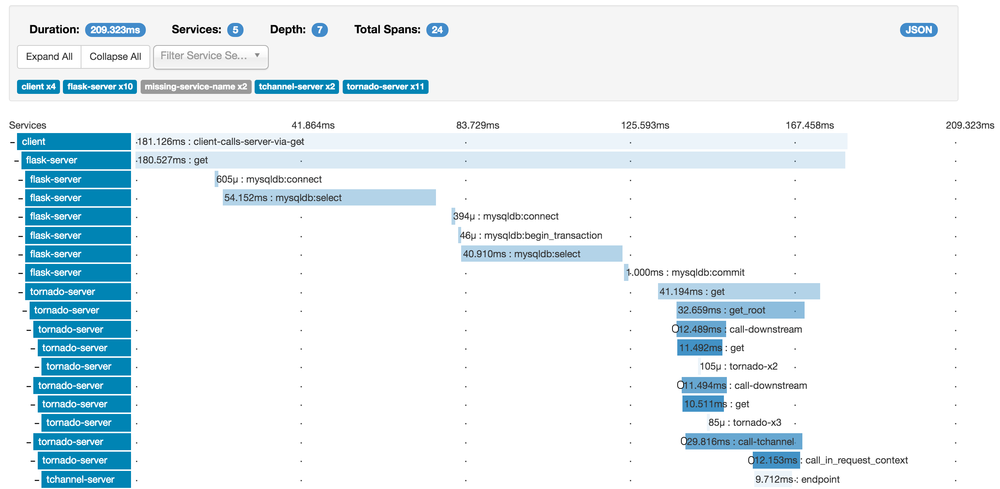
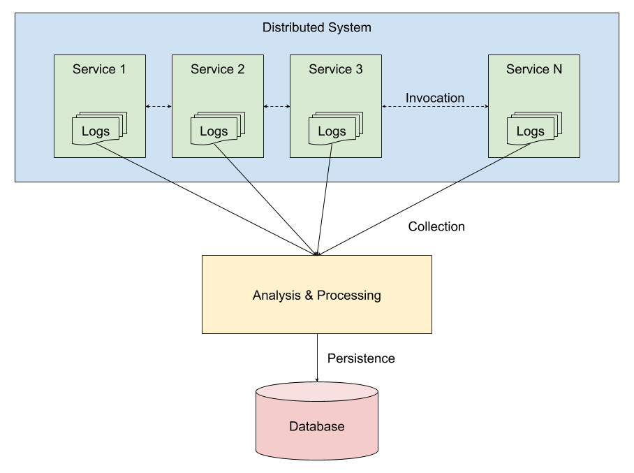
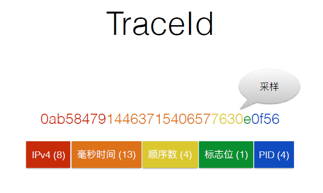
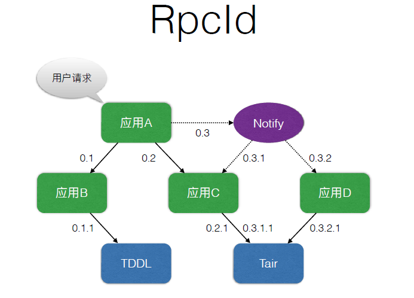
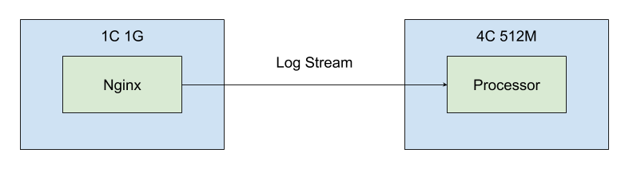
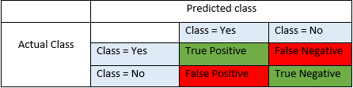

# 第四届阿里中间件性能挑战赛（极客赛）

## 一、赛题背景

在刚刚结束的挑战赛初赛环节中，我们尝试实现了一个高性能的 Service Mesh Agent。在这样一个简化场景中，整个系统共涉及到 5 个服务，分别是：1 个 Consumer，3 个 Provider 和 1 个 etcd。而如果把 Agent 也算在内的话，系统中共有 9 个程序在运行。设想在天猫或淘宝这样庞大的分布式系统中，所运行的程序将会不计其数。如何在如此大规模的集群中对服务请求的调用过程进行跟踪，以及如何从生成的海量数据日志里发现那些异常的调用链，是本题目将要讨论和处理的问题。

分布式调用跟踪体系源自 Google 的一篇[论文](https://ai.google/research/pubs/pub36356)，其核心思想是在请求发起的时候为该请求分配一个 ID，此 ID 会贯穿请求流经的每一个应用及方法调用。跟踪系统以这个 ID 为线索记录下每个调用过程的起止时间、耗时、方法名称、参数和返回值等等。这些数据经过加工处理以后，就可以展现为跨越多个系统的调用链跟踪视图。



有关 Google Dapper 的更多信息请参考：

* [Dapper，大规模分布式系统的跟踪系统](https://bigbully.github.io/Dapper-translation/)
* [Google Dapper——大规模分布式系统的基础跟踪设施](http://duanple.blog.163.com/blog/static/70971767201329113141336/)

## 二、赛题说明

### 2.1、概念解释

为了便于下文描述，我们约定几个概念：

| 概念 | 解释 |
| --- | ---- |
| **调用跟踪系统** | 简称跟踪系统，在这里所谓的调用跟踪系统不是一个独立运行的系统，而是功能上的一个抽象。任何具有调用跟踪功能的业务系统都可以被称为调用跟踪系统，其主要功能是跟踪方法调用，并按指定格式输出调用跟踪日志记录。 |
| **调用链** | 指跨越分布式系统各个服务节点的方法调用链路，类似于单体系统中的调用栈，通常是树型结构。 |
| **调用跟踪日志** | 简称跟踪日志或日志，指调用跟踪系统输出的日志，其不同于业务日志，通常单独存放且具有完善的格式定义。如果我们说“一组调用跟踪日志”，其含义是具有相同跟踪 ID 的日志记录，这样的一组日志可以构造出一个调用链。 |
| **调用跟踪日志记录** | 简称跟踪日志记录或日志记录，指每个服务节点上的跟踪系统输出的跟踪日志，是整个调用链的组成部分。例如：一次方法调用会生成一条日志记录。 |

### 2.2、超大规模数据量下的分布式调用链分析



如图所示，分布式系统中的各个服务在响应用户请求的时候会产生调用跟踪日志，这些日志被若干采集器采集到一个分析和处理系统中，该系统对日志条目进行分组、排序和聚合等操作，然后持久化到数据库。

这样一个日志采集和分析系统具有如下一些特点：

1. 由于业务系统是分布式的，一个请求会被多个服务来处理，因此跟踪日志记录是散落在各个服务节点中的；
2. 日志采集器在采集每个节点上日志的时候是独立工作的，因此虽然日志记录的产生是有先后顺序的，但被采集到分析和处理系统中的日志记录是不能保证顺序的；
3. 由于种种原因，日志的生成和采集不能保证完整性，个别情况下日志记录会发生丢失，导致跟踪日志残缺（如中断或缺头少尾等）；
4. 采集器采集日志会出现各种不可预估的状况，比如：采集器异常后重启、服务节点到采集器的网络发生抖动、瞬间日志量暴增导致采集器拥堵等等，这些情况都有可能导致本来时间上靠得很近的两段日志记录，却间隔了很长时间才被采集到；
5. 没有办法标志一组跟踪日志在何时、何处结束。

鉴于以上这些特性，当日志量非常巨大的时候，采集和分析系统想要从中寻找到符合条件的调用链就会变得异常复杂，尤其是在系统资源有限的情况下。本题目的目标就是在资源受限的情况下从庞大的日志记录中检索到满足条件的跟踪日志。

### 2.3、数据说明

```
c0a8050115305166446491028deab6|1530516644649|0|27|00|traceName13|@a=1&
c0a8050115305166446471020deab6|1530516644655|2|0.1.1|service.18.1.2|methodName1812|00|10.0.0.181|20|0|@a=1&s=fd4a3efc&@ps=f8cfe90f&
c0a8050115305166446471006deab6|1530516644649|2|0.1|service.4.0.1|methodName401|00|10.0.0.40|27|0|@a=1&s=f3d30de9&@ps=&
c0a8050115305166446471019deab6|1530516644655|2|0.1.1|service.17.1.2|methodName1712|00|10.0.0.171|21|0|@a=1&s=93a61e3c&@ps=f71b0caf&
c0a8050115305166446471020deab6|1530516644655|1|0.1.1|service.18.1.2|methodName1812|10.0.0.182|[0, 21]|00|0|0|@a=1&s=f8cfe90f&
c0a8050115305166446471007deab6|1530516644674|2|0.1.1.2|service.5.2.3|methodName523|00|10.0.0.52|2|0|@a=1&s=69fcb275&@ps=a8bedaf0&
c0a8050115305166446471007deab6|1530516644674|1|0.1.1.2|service.5.2.3|methodName523|10.0.0.53|[0, 2]|00|0|0|@a=1&s=a8bedaf0&
c0a8050115305166446471019deab6|1530516644655|1|0.1.1|service.17.1.2|methodName1712|10.0.0.172|[0, 21]|00|0|0|@a=1&s=f71b0caf&
c0a8050115305166446471006deab6|1530516644647|1|0.1|service.4.0.1|methodName401|10.0.0.41|[1, 29]|00|0|0|@a=1&
c0a8050115305166446471010deab6|1530516644649|2|0.1|service.8.0.1|methodName801|00|10.0.0.80|27|0|@a=1&s=faa67f69&@ps=&
c0a8050115305166446471010deab6|1530516644647|1|0.1|service.8.0.1|methodName801|10.0.0.81|[1, 30]|00|0|0|@a=1&
c0a8050115305166446501035deab6|1530516644657|2|0.1.1|service.20.1.2|methodName2012|00|10.0.0.201|18|0|@a=1&s=7b09303c&@ps=200fb5af&
c0a8050115305166446501035deab6|1530516644657|1|0.1.1|service.20.1.2|methodName2012|10.0.0.202|[0, 20]|00|0|0|@a=1&s=200fb5af&
c0a8050115305166446471009deab6|1530516644647|0|31|00|traceName7|@a=1&
```

#### 2.3.1、日志记录类型

日志记录有三种类型：

**入口类型：**
格式：`TraceId | 时间戳 | RpcId | 耗时 | 错误码 | 服务名 | 用户数据`
样例：`c0a8050115304435465056955d9b13|1530443546505|0|17|00|traceName17|@a=1&`

**客户端类型：**
格式：`TraceId | 时间戳 | RpcType | RpcId | 服务名 | 方法名 | 对端IP | 耗时 | 错误码 | 预留 | 预留 | 用户数据`
样例：`c0a8050115304435433133591d9b13|1530443543320|1|0.1.1.1|service.25.2.3|methodName2523|10.0.0.253|[0, 23]|00|0|0|@a=1&`

**服务端端型：**
格式：`TraceId | 时间戳 | RpcType | RpcId | 服务名 | 方法名 | 错误码 | 对端IP | 耗时 | 预留 | 用户数据`
样例：`c0a8050115304435433133591d9b13|1530443543320|2|0.1.1|service.25.1.2|methodName2512|00|10.0.0.251|85|0|@a=1&s=8b3dd3fc&@ps=2898038f&`

#### 2.3.2、字段详解

**TraceId：**在请求最初发起时，调用跟踪系统为该请求分配的 ID。此 ID 会跟随调用链传播到途经的每一个方法调用。TraceId 的格式如下：



**时间戳：**打印该条日志记录的时间，单位毫秒。

**RpcType：**

* 入口类型：`0（可省略）`
* 客户端类型：`1`
* 服务端类型：`2`

**RpcId：**在一个调用链中为每次方法调用分配的 ID。采用分级方式来表示，用于标识同一个链路请求不同调用的顺序与嵌套层次：从 0 开始，同级调用序号递增，子级调用添加一个“.”，并重置序号：



**服务名：**被调用的服务名称。

**方法名：**被调用的方法名称。

**对端 IP：**请求端的 IP 地址。

**耗时：**耗时有两种格式：

* 单独一个数字，表示运行该方法所消耗的时间，这个时间包含了调用其他嵌套方法的耗时。
* 两个数字组成的数组：第一个数字表示序列化耗时，第二个数字代表总耗时。

**错误码：**

* 正确：`00`
* 错误：`01`

**预留：**预留位置。

**用户数据：**用户自定义数据，格式为：`@key1=value1&@key2=value2`。

### 2.4、实现要求

### 2.4.1、基本要求

给定一份日志文件，在限定的内存条件下，找出符合如下要求的调用链：

1. 耗时大于 `200ms`
2. 错误码为 `01`
3. 用户数据中包含 `@force=1`

**注：以上要求满足一条即视为满足。**

### 2.4.2、其他约束

1. 日志文件大小约为 2.5G
2. 限定可使用的内存大小为 512M（该内存为 Docker 容器占用的内存）
3. 可以使用的 CPU 核心数为 4
4. 需要以流的方式来处理数据，而不是批的方式
5. 可以使用磁盘
6. 语言和使用到的技术不受限制
7. 提交 Docker 镜像以供评测

### 2.4.3、数据输出

将所有找到的日志记录按照如下要求输出：

1. 以 TraceId 分组，每组数据输出到一个文件，文件名为 TraceId
2. 文件内容包含该 TraceId 对应的调用链中的所有原始日志记录（每条记录一行），并按照 RpcId 排序（如：`0 > 0.1 > 0.2 > 0.2.1 > 0.2.2 > 0.3`），如果 RpcId 相同则再按照 RpcType 排序（如：`0 > 1 > 2`）
3. 所有文件保存到容器中的 `/root/result` 目录下

如：经过计算，找到的调用链内容如下：

```
c0a8050115305166446471011deab6|1530516644647|0|114|00|traceName9|@a=1&
c0a8050115305166446471011deab6|1530516644647|1|0.1|service.9.0.1|methodName901|10.0.0.91|[1, 57]|00|0|0|@a=1&
c0a8050115305166446471011deab6|1530516644654|2|0.1|service.9.0.1|methodName901|00|10.0.0.90|50|0|@a=1&s=fc5b5bc9&@ps=&
c0a8050115305166446471011deab6|1530516644655|1|0.1.1|service.9.1.2|methodName912|10.0.0.92|[0, 1]|00|0|0|@a=1&s=fc5b5bc9&
c0a8050115305166446471011deab6|1530516644655|2|0.1.1|service.9.1.2|methodName912|00|10.0.0.91|1|0|@a=1&s=4f4f5df0&@ps=fc5b5bc9&
c0a8050115305166446471011deab6|1530516644658|1|0.1.2|service.9.1.2|methodName912|10.0.0.92|[0, 41]|00|0|0|@a=1&s=fc5b5bc9&
c0a8050115305166446471011deab6|1530516644658|2|0.1.2|service.9.1.2|methodName912|00|10.0.0.91|41|0|@a=1&s=4f4f5df0&@ps=fc5b5bc9&
c0a8050115305166446471011deab6|1530516644658|1|0.1.2.1|service.9.2.3|methodName923|10.0.0.93|[0, 11]|00|0|0|@a=1&s=4f4f5df0&
c0a8050115305166446471011deab6|1530516644658|2|0.1.2.1|service.9.2.3|methodName923|00|10.0.0.92|6|0|@a=1&s=b54be6f5&@ps=4f4f5df0&
c0a8050115305166446471011deab6|1530516644672|1|0.1.2.2|service.9.2.3|methodName923|10.0.0.93|[0, 12]|00|0|0|@a=1&s=4f4f5df0&
c0a8050115305166446471011deab6|1530516644673|2|0.1.2.2|service.9.2.3|methodName923|00|10.0.0.92|11|0|@a=1&s=b54be6f5&@ps=4f4f5df0&
c0a8050115305166446471011deab6|1530516644690|1|0.1.2.3|service.9.2.3|methodName923|10.0.0.93|[0, 6]|00|0|0|@a=1&s=4f4f5df0&
c0a8050115305166446471011deab6|1530516644690|2|0.1.2.3|service.9.2.3|methodName923|00|10.0.0.92|6|0|@a=1&s=b54be6f5&@ps=4f4f5df0&
c0a8050115305166446471011deab6|1530516644708|1|0.2|service.9.0.1|methodName901|10.0.0.91|[0, 50]|00|0|0|@a=1&
c0a8050115305166446471011deab6|1530516644708|2|0.2|service.9.0.1|methodName901|00|10.0.0.90|48|0|@a=1&s=fc5b5bc9&@ps=&@force=1&
c0a8050115305166446471011deab6|1530516644708|1|0.2.1|service.9.1.2|methodName912|10.0.0.92|[0, 41]|00|0|0|@a=1&s=fc5b5bc9&
c0a8050115305166446471011deab6|1530516644709|2|0.2.1|service.9.1.2|methodName912|00|10.0.0.91|38|0|@a=1&s=4f4f5df0&@ps=fc5b5bc9&
c0a8050115305166446471011deab6|1530516644709|1|0.2.1.1|service.9.2.3|methodName923|10.0.0.93|[0, 13]|00|0|0|@a=1&s=4f4f5df0&
c0a8050115305166446471011deab6|1530516644709|2|0.2.1.1|service.9.2.3|methodName923|00|10.0.0.92|11|0|@a=1&s=b54be6f5&@ps=4f4f5df0&
c0a8050115305166446471011deab6|1530516644723|1|0.2.1.2|service.9.2.3|methodName923|10.0.0.93|[0, 17]|00|0|0|@a=1&s=4f4f5df0&
c0a8050115305166446471011deab6|1530516644724|2|0.2.1.2|service.9.2.3|methodName923|00|10.0.0.92|12|0|@a=1&s=b54be6f5&@ps=4f4f5df0&
```

1. 满足条件 `@force=1`
2. 所有日志记录都包含相同的 `TraceId`
3. 日志记录先按照 `RpcId` 排序，再按照 `RpcType` 排序
4. 该文件存储路径为：`/root/result/c0a8050115305166446471011deab6`

**注：具体实现细节请参考样例代码。**

## 三、评测

### 3.1、评测环境

本次评测依然使用 Docker 镜像来运行。相比初赛而言，评测环境要简单许多，如下图：



蓝色的方框为 Docker 容器。左边的容器提供一个 Nginx 服务，用来从中下载日志文件（地址固定为：http://nginx/trace.dat ），以模拟日志数据流；右边的容器是待评测的 Processor 系统。Processor 从 Nginx 中获取数据流，并将处理结果按要求输出。

**注：该 Processor 系统不是一个长期运行的服务，而只是一个处理程序，处理完结果并输出以后，要自行退出。**

### 3.2、评测方法

本项目的评测方法是根据输出的结果文件，计算一个得分，该得分由两部分数据计算得来：一个是 F1 Score，另一个是 Processor 程序的运行时间。计算公式为：

```
得分 = F1 * 10000 / 耗时
```

有关 F1 Socre、耗时和得分的详细说明，请参考《附录三》。

**注：存在一种特殊情况，程序计算得到的 F1 Score 很小但不为零，且耗时也非常少，这样也有可能得到一个非常大的最终得分，为了避免这个问题，评测程序中限定了只有 F1 Score 大于 0.5，才会统计最终结果，小于 0.5 的最终结果都为 0。**

## 附录一：代码仓库

* [评测脚本](https://code.aliyun.com/middlewarerace2018/benchmarker4geeks)
* [样例代码](https://code.aliyun.com/middlewarerace2018/mwrace2018-geeks-demo)

## 附录二：镜像仓库

* Nginx (registry.cn-hangzhou.aliyuncs.com/aliware2018/nginx)
* Processor (registry.cn-hangzhou.aliyuncs.com/aliware2018/geeks-demo)

## 附录三：评分参数详解

### F1 Score

F1 Score 是评价分类模型性能的一种手段，根据定义：

```
F1 = 2 * (Precision * Recall) / (Precision + Recall)
Precision = TP / (TP + FP)
Recall = TP / (TP + FN)
```

其中 TP(True Positive)、FP(False Positive) 和 FN(False Negative) 源自 Confusion Matrix 中的概念。如下图：



有关 Confusion Matrix 和 F1 Score 的详细解释请参考：

* [Confusion matrix](https://en.wikipedia.org/wiki/Confusion_matrix)
* [Simple guide to confusion matrix terminology](https://www.dataschool.io/simple-guide-to-confusion-matrix-terminology/)
* [Accuracy, Precision, Recall & F1 Score: Interpretation of Performance Measures](http://blog.exsilio.com/all/accuracy-precision-recall-f1-score-interpretation-of-performance-measures/)
* [精确率、召回率、F1 值、ROC、AUC 各自的优缺点是什么？](https://www.zhihu.com/question/30643044)

因此，计算 F1 Score 就是要统计结果集中 TP、FP 和 FN 的数量：

| 状态 | 定义 | 分类 |
| --- | ---- | --- |
| 正确 | 输出文件的文件名和内容与目标文件的文件名和内容都相同 | TP |
| 错误 | 输出文件的文件名和目标文件相同，但内容不相同 | FN |
| 错误 | 输出文件与目标文件相比缺失 | FN |
| 错误 | 输出文件与目标文件相比多余 | FP |

### 耗时

耗时即 Processor 程序从启动到退出所经历的时间，单位是秒。

### 得分

最终得分的含义是：F1 Score 越大、耗时越少则得分越高。
